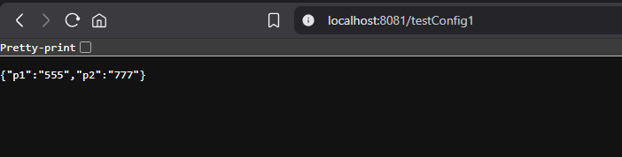
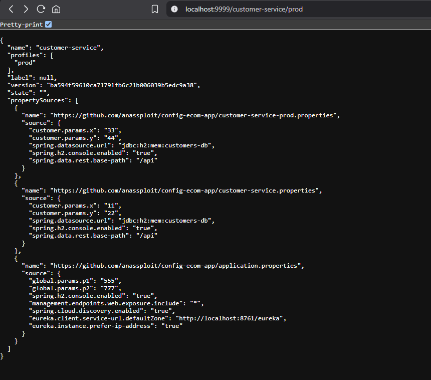
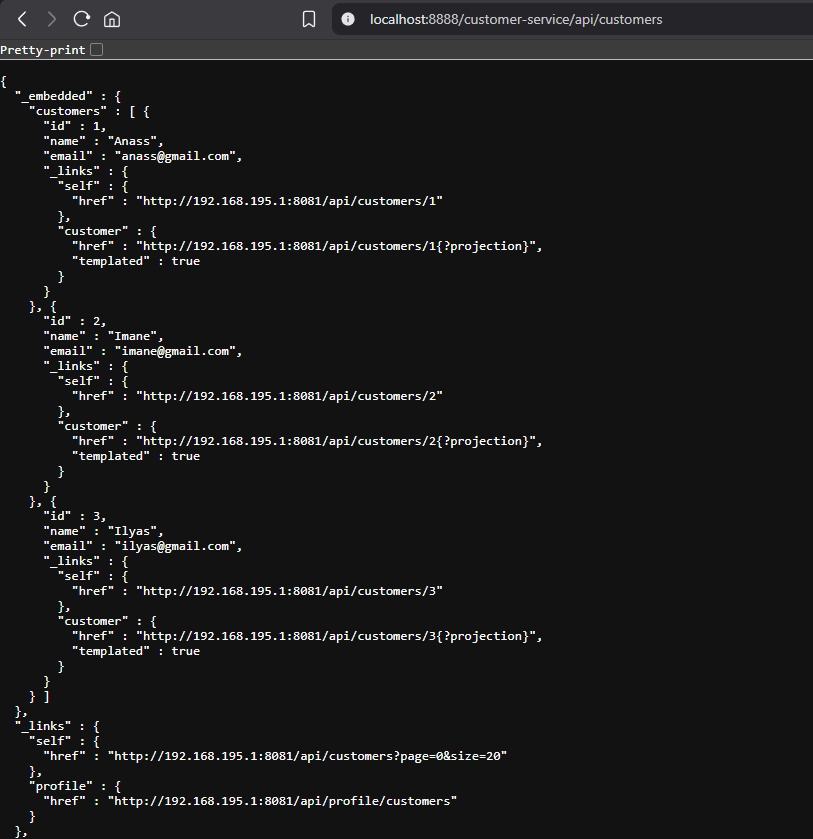
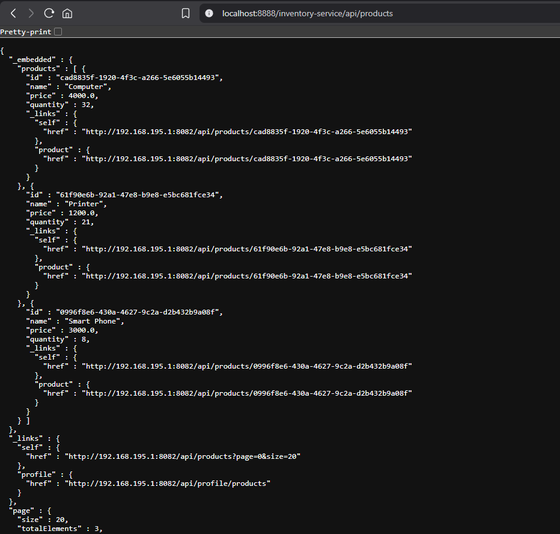
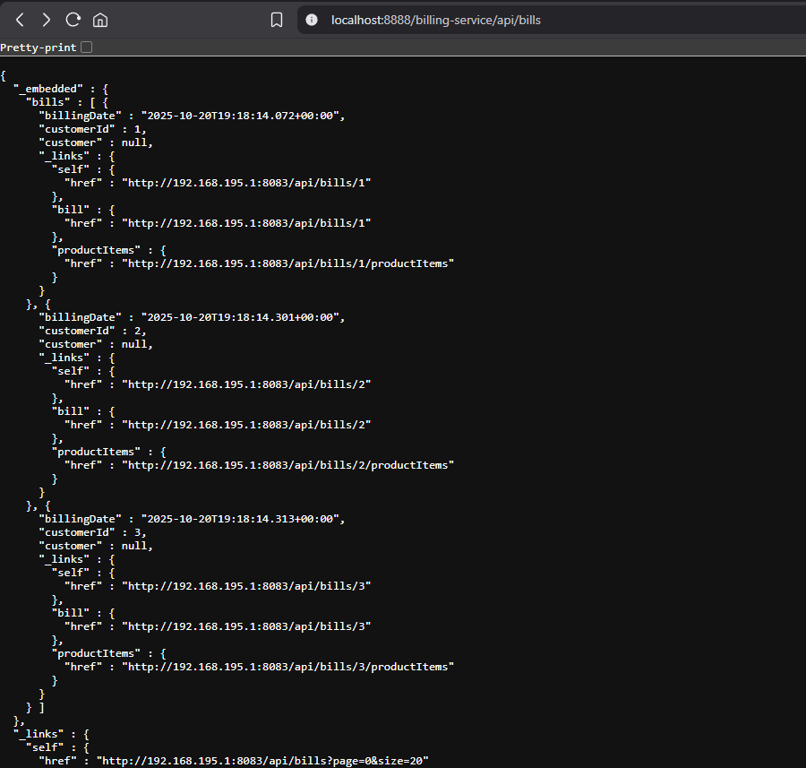
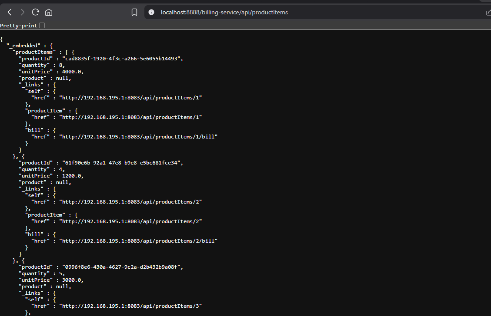
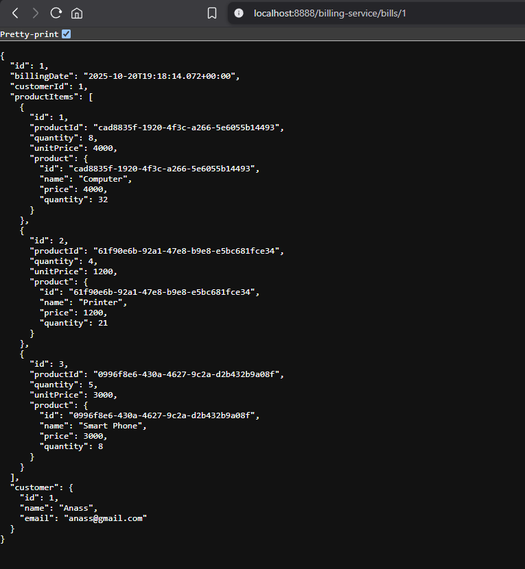

# Distributed E-Commerce Application

This project is a distributed microservices-based e-commerce application built with Spring Boot. The application demonstrates a modern microservices architecture with separate services for customer management, inventory, billing, and service discovery.

## Architecture Overview

The application consists of the following microservices:

1. **Customer Service**

   - Manages customer information
   - Provides REST endpoints for customer CRUD operations
   - Uses H2 in-memory database
   - Accessed via Gateway at `/customer-service`

2. **Inventory Service**

   - Handles product inventory
   - Manages product information and stock levels
   - Provides REST endpoints for product management
   - Accessed via Gateway at `/inventory-service`

3. **Billing Service**

   - Manages billing and orders
   - Links customers with their purchases
   - Handles product items and billing records
   - Accessed via Gateway at `/billing-service`

4. **Discovery Service** (Port 8761)

   - Eureka Server for service discovery
   - Enables dynamic service registration and discovery
   - Provides service registry and load balancing
   - Manages service instances and health checks

5. **Gateway Service** (Port 8888)
   - Spring Cloud Gateway for unified access
   - Routes requests to appropriate microservices
   - Handles cross-cutting concerns
   - Single entry point for all API requests

## Screenshots and Explanations

### 1. Test Configuration


Shows the test configuration with global parameters (p1: 555, p2: 777) demonstrating configuration management across services.

### 2. Customer Service Configuration


Displays the customer service configuration including:

- Service name and profiles
- Database configuration
- REST API base path
- Multiple property sources from config server
- Integration with Eureka discovery service

### 3. Customer Data


Shows the customer REST API response with:

- List of customers with their details
- HATEOAS links for each customer
- Pagination support
- Projection capabilities

### 4. Product Inventory


Demonstrates the inventory service showing:

- Product listings with IDs, names, and quantities
- Price information
- HATEOAS links for each product
- RESTful API structure

### 5. Billing Records


Shows the billing service functionality:

- List of bills with billing dates
- Customer associations
- Links to detailed bill information
- Product items references

### 6. Product Items in Bills


Displays the product items associated with bills:

- Product details and quantities
- Unit prices
- Links to related resources
- Bill associations

### 7. Detailed Bill Example


Shows a detailed bill record containing:

- Complete bill information
- Customer details
- List of purchased products
- Quantities and prices
- Full product details

## Technical Features

- RESTful APIs with HATEOAS
- Service Discovery with Eureka
- Centralized Configuration
- API Gateway
- Database per Service
- Event-Driven Architecture
- Spring Data REST
- Spring Cloud

## Getting Started

### Prerequisites

- Java 17 or higher
- Maven 3.6 or higher
- Git

### Running the Application

1. Start the Discovery Service:

```bash
cd discovery-service
mvn spring-boot:run
```

2. Start the Configuration Service (if separate from Discovery)

3. Start the Core Services:

```bash
# Customer Service
cd customer-service
mvn spring-boot:run

# Inventory Service
cd inventory-service
mvn spring-boot:run

# Billing Service
cd billing-service
mvn spring-boot:run
```

4. Start the Gateway Service:

```bash
cd gateway-service
mvn spring-boot:run
```

## API Documentation

All services are accessible through the Gateway Service (Port 8888) which routes requests to the appropriate microservice:

### Service Endpoints

- Customer Service: `http://localhost:8888/customer-service/api/customers`
- Inventory Service: `http://localhost:8888/inventory-service/api/products`
- Billing Service: `http://localhost:8888/billing-service/api/bills`
- Gateway Service: `http://localhost:8888`
- Eureka Dashboard: `http://localhost:8761`

### API Features

- All endpoints support HATEOAS with HAL format
- Pagination is available using `?page=0&size=20`
- Projections can be requested using `?projection=projectionName`
- Cross-service communication is handled transparently

### Example Requests

```bash
# List all customers
curl http://localhost:8888/customer-service/api/customers

# Get a specific product
curl http://localhost:8888/inventory-service/api/products/{id}

# Get bills for a customer
curl http://localhost:8888/billing-service/api/bills?customerId={id}
```

## Architecture Diagram

The application follows a microservices architecture pattern with:

- Distributed services
- API Gateway
- Service Discovery
- Configuration Management
- Database per Service

## Author

- Anass EL HARRATI
